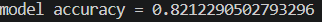
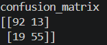

# Titanic Survival Prediction using Machine Learning

## Project Overview

 The Titanic Survival Prediction project is a Machine Learning classification project that predicts whether a passenger survived the Titanic disaster or not. The model is trained using the Titanic dataset and analyzes passenger information such as passenger class, gender, age, fare, and family details to predict survival. This project demonstrates the complete Machine Learning workflow from data preprocessing to model evaluation.

## Objective

 The objective of this project is to build a Machine Learning model that can predict passenger survival based on available passenger information.

## Dataset Information

 **Dataset:** Titanic Dataset

### Dataset Summary:

 *Total Records: 891*
 
 *Total Columns: 12*

### Dataset Columns: 

 - PassengerId
 - Survived
 - Pclass
 - Name
 - Sex
 - Age
 - SibSp
 - Parch
 - Ticket
 - Fare
 - Cabin
 - Embarked

### Target Variable:
 - Survived

## Features Used for Model Training
 The following features were selected for training the machine learning model:

 - *Pclass*
 - *Sex*
 - *Age*
 - *SibSp*
 - *Parch*
 - *Fare*
 - *Embarked*

## Technologies Used

 - *Python*
 - *Pandas*
 - *Scikit-Learn*
 - *Joblib* 

## Project Workflow

 **1. Data Loading:-** The Titanic dataset was loaded using the Pandas library.

 **2. Data Exploration:-** The dataset was explored to understand:

   - Dataset structure*
   - Column information
   - Missing values
   - Data types

 **3. Data Cleaning:-** Missing values were handled using appropriate techniques:

   - *Age column:-* Filled using Median value. 

   - *Embarked column:-* Filled using Mode value.

 **4. Data Preprocessing:-** Categorical data was converted into numerical form using Label Encoding (Sex & Embarked).

 **5. Feature Selection:-** Important features were selected for training the model.

 **6. Train-Test Split:-** The dataset was divided into:

   - *Training Data (80%) :-* Use 80% of data for model training.

   - *Testing Data (20%) :-* use 20% data for model testing.

 **7. Model Training:-** A Random Forest Classifier was used to train the model.

 **8. Prediction:-** The trained model was used to predict survival outcomes on unseen data.

 **9. Model Evaluation:-** The model performance was evaluated using Accuracy Score and Confusion Matrix.

## Machine Learning Algorithm

 **Random Forest Classifier:-** Random Forest is an ensemble machine learning algorithm that combines multiple decision trees to improve prediction accuracy and reduce overfitting.

### Results:
 *Model Accuracy(82.12%).*

 ### Model Accuracy Images: 

 

## Confusion Matrix

  [[92 13]
   [19 55]]

  The model achieved good prediction accuracy and successfully classified passenger survival outcomes.

  ### Confusion Matrix Images: 

  

## Installation

 *Install the required libraries:* pip install -r requirements.txt

 *Run the Project:-* python Titanic.py

## Learning Outcomes

 **This project helped in understanding:**

   - *Data Cleaning*
   - *Handling Missing Values*
   - *Data Preprocessing*
   - *Label Encoding*
   - *Feature Selection*
   - *Train-Test Split*
   - *Random Forest Classifier*
   - *Model Evaluation*
   - *Confusion Matrix*
   - *Machine Learning Workflow*

## Future Improvements 
 **Possible future enhancements include:**
   - *Hyperparameter Tuning*
   - *Feature Engineering*
   - *Data Visualization*
   - *Model Deployment using Streamlit or Flask*
   - *Improving Prediction Accuracy*

### AUTHOR: 
   **Sadhna Kumari**