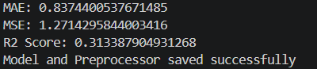
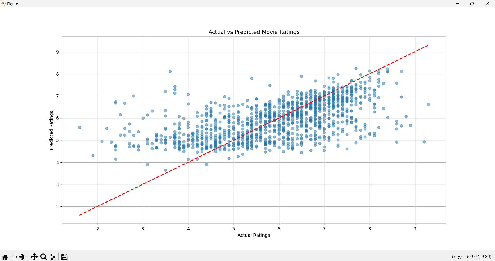

# Movie Rating Prediction with python

## Project Overview

This project predicts IMDb movie ratings using Machine Learning techniques. The model is trained on the IMDb Movies India dataset and uses features such as movie genre, director, actors, release year, duration, and vote count to estimate movie ratings.

The project covers the complete machine learning workflow including data preprocessing, feature engineering, model training, evaluation, visualization, and model saving.

## Objective

To build a machine learning model capable of predicting movie ratings based on movie-related information and evaluate its performance using regression metrics.

## Dataset

**Dataset:** IMDb Movies India Dataset

### Features Used

   * Year
   * Duration
   * Votes
   * Genre
   * Director
   * Actors (combined Actor 1, Actor 2, and Actor 3)

### Target Variable

   * Rating

## Technologies Used

   * Python
   * Pandas
   * Matplotlib
   * Scikit-Learn
   * Joblib

## Data Preprocessing

The following preprocessing steps were performed:

### 1. Data Cleaning

   * Removed missing values
   * Removed duplicate records

### 2. Feature Transformation

#### Year

Converted values such as:

(2019)

to:

2019

#### Duration

Converted Duration values such as:

109 min

to:

109

#### Votes

Converted values such as:

1,086

to:

1086

### 3. Feature Engineering

A new feature called **Actors** was created by combining:

   * Actor 1
   * Actor 2
   * Actor 3

This helps the model learn actor-related patterns more effectively.

### 4. Categorical Encoding

One-Hot Encoding was applied to:

   * Genre
   * Director
   * Actors

using Scikit-Learn's `OneHotEncoder` and `ColumnTransformer`.

## Machine Learning Model

### Algorithm Used

**Random Forest Regressor**

### Model Configuration

RandomForestRegressor(
    n_estimators=500,
    max_depth=20,
    min_samples_split=5,
    min_samples_leaf=2,
    random_state=42,
    n_jobs=-1
)

## Model Performance

### Evaluation Metrics

  Mean Absolute Error (MAE) :   0.8374 

  Mean Squared Error (MSE) :    1.2714

  R² Score :                    0.3134 

### Evaluation Matrics Screenshot

### Performance Analysis

   * The model predicts movie ratings with an average error of approximately **0.84 rating points**.
   * Random Forest Regression successfully captures relationships between movie attributes and ratings.
   * The model provides stable predictions across different rating ranges.

## Visualization

The project generates an **Actual vs Predicted Ratings** scatter plot.

### Graph Screenshot

### Interpretation

   * The red dashed line represents perfect predictions.
   * Points closer to the red line indicate more accurate predictions.
   * The scatter plot shows a positive relationship between actual and predicted ratings, demonstrating that the model has        learned meaningful patterns from the dataset.

## Saved Files

After training, the project automatically saves:

### Trained Model

movie_rating_model.pkl

### Note

The trained model file (.pkl) is not included due to GitHub file size limitations. It can be generated by running the training script.

### Preprocessing Model

preprocessor.pkl

This file can be reused later for preprocessing new data without recreating the preprocessing pipeline.

## How to Run

### Navigate to the Project Folder

Movie-Rating-Prediction

### Install Required Libraries

pip install -r requirements.txt

### Run the Project

python movie_rating.py

##  Future Improvements

   * Hyperparameter Tuning
   * Cross Validation
   * Feature Engineering
   * XGBoost Implementation
   * CatBoost Implementation
   * Streamlit Web Application
   * Model Deployment

## Author

**Sadhna Kumari**

